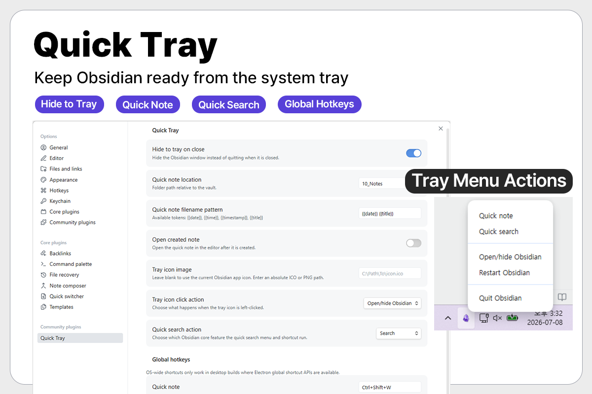

# Quick Tray

[English](README.md) | 한국어

Quick Tray는 Obsidian을 시스템 트레이에서 계속 사용할 수 있게 하고, 빠른 노트와 빠른 검색 기능을 추가하는 데스크톱 전용 플러그인입니다.

커뮤니티 플러그인: https://community.obsidian.md/plugins/quick-tray

## 스크린샷



## 기능

- Obsidian을 종료하지 않고 트레이로 숨깁니다.
- 트레이 메뉴에서 Obsidian 열기, 숨기기, 재실행, 종료를 실행합니다.
- 트레이 또는 전역 단축키로 빠른 노트를 작성합니다.
- 트레이 또는 전역 단축키로 Obsidian 검색 또는 빠른 전환기를 엽니다.
- 트레이 아이콘 왼쪽 클릭 동작을 선택할 수 있습니다.
- 빠른 노트 위치, 이름 규칙, 단축키, 트레이 아이콘을 설정할 수 있습니다.
- 기본 언어는 영어이며, Obsidian 언어가 한국어일 때 한국어로 표시됩니다.

## 기본 단축키

- 빠른 노트: `Ctrl+Shift+Q`
- 빠른 검색: `Ctrl+Shift+K`
- Obsidian 열기/숨기기: `Ctrl+Shift+O`

## 빠른 노트 이름 토큰

- `{{date}}`: `YYYY-MM-DD`
- `{{time}}`: `HH-mm`
- `{{timestamp}}`: `YYYYMMDDHHmmss`
- `{{title}}`: 노트 제목

## 설치

Obsidian 커뮤니티 플러그인 브라우저에서 Quick Tray를 설치할 수 있습니다.

1. `설정`을 엽니다.
2. `커뮤니티 플러그인`으로 이동합니다.
3. `Quick Tray`를 검색합니다.
4. 플러그인을 설치하고 활성화합니다.

플러그인 페이지를 직접 열 수도 있습니다.

https://community.obsidian.md/plugins/quick-tray

## 수동 설치

1. `npm install`을 실행합니다.
2. `npm run build`를 실행합니다.
3. `main.js`, `manifest.json`, `styles.css`를 아래 폴더에 복사합니다.

```text
VaultFolder/.obsidian/plugins/quick-tray/
```

4. Obsidian 커뮤니티 플러그인에서 `Quick Tray`를 활성화합니다.

## 알려진 제한 사항

- Quick Tray는 Windows 데스크톱 환경을 대상으로 합니다.
- 글로벌 단축키는 이미 다른 프로그램에서 사용 중이거나 Electron 또는 Windows 정책에 의해 제한되는 경우 등록되지 않을 수 있습니다.
- Quick Tray는 Obsidian이 실행 중인 동안에만 동작합니다. Obsidian을 완전히 종료한 상태에서 실행하거나 제어할 수는 없습니다.

## 참고

기본 트레이 아이콘은 현재 Obsidian 앱 아이콘을 사용합니다. Obsidian 로고의 권리는 Obsidian 프로젝트에 있습니다.
